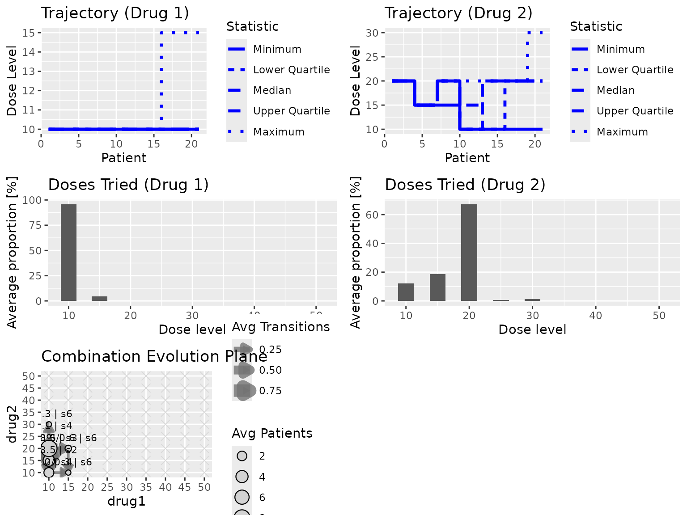
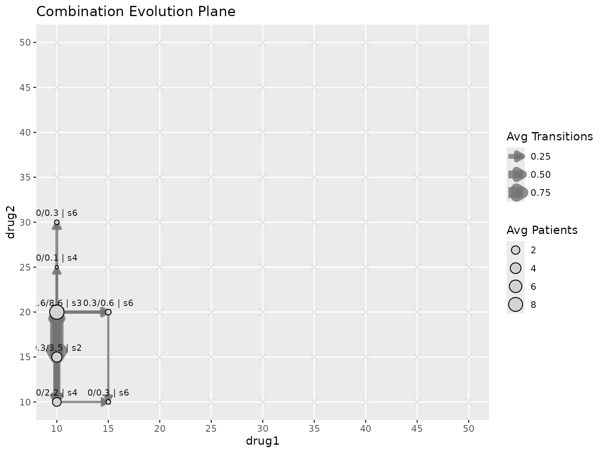
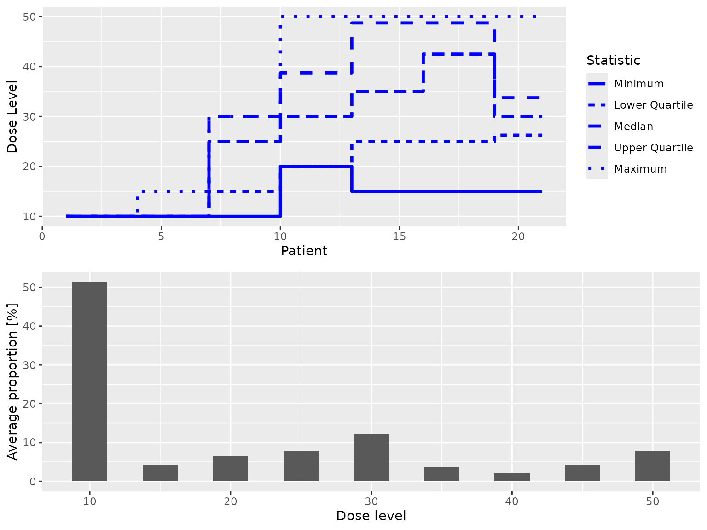

# Combination designs

## Introduction

Here we show how `crmPack` can be used for drug combination dose
escalation designs. We start with the simple case of a single
combination arm, and then move on to the more complex case of parallel
monotherapy and combination arms.

## Single combination arm

The package implements the 5-parameter BLRM approach by Neuenschwander
et al. (2014) (note that a presentation slide deck is available
[here](https://de.slideshare.net/slideshow/eugm-2014-roychaudhuri-phase-1-combination/50032570)).

### Model specification

- Let $`\textrm{odds}(p)=p/(1-p)`$ be the odds transformation of the
  probability $`p`$, such that
  $`\textrm{logit}(p) = \log(\textrm{odds}(p))`$.

- Let $`x_i`$ be the dose of drug $`i=1,2`$, and $`p(x_1, x_2)`$ be the
  probability of DLT with doses $`x_1`$ and $`x_2`$.

- The reference doses for the two compounds are again denoted by
  $`x_1^{*}`$ and $`x_2^{*}`$, and the single-agent DLT probabilities at
  these reference doses are denoted by $`p(x_1)`$ and $`p(x_2)`$,
  respectively.

- Then the model assumes a linear interaction function:

  ``` math
  \textrm{odds}(p(x_1, x_2)) = \textrm{odds}(p_0(x_1, x_2)) \cdot \exp(\eta x_1/x_1^{*} x_2/x_2^{*}),
  ```

  - where $`\eta`$ is the interaction coefficient (positive values
    correspond to synergistic toxicity, zero corresponds to additive
    effect without interaction, and negative values correspond to
    antagonistic toxicity).
  - This model is also called the “dual combo model” by Novartis
  - Under no interaction with $`\eta=0`$, this reduces the probability
    $`\textrm{odds}(p(x_1, x_2))`$ to
    ``` math
    \begin{align*}
    p_0(x_1, x_2) &= p(x_1) + p(x_2) - p(x_1)p(x_2)\\
     &= 1 - (1 - p(x_1))(1 - p(x_2)).
    \end{align*}
    ```
  - As a prior for $`\eta`$ we use either a normal distribution (if
    negative values, i.e. antagonistic effects, are plausible) or a
    log-normal distribution (if only positive values, i.e. synergistic
    effects, are plausible).

- Now for the single-agent DLT probabilities $`p(x_1)`$ and $`p(x_2)`$
  we assume the standard logistic log-normal models:

  ``` math
  \textrm{logit}[p(x_i)] = \alpha_i + \beta_i \log(x_i/x_i^{*}),
  ```

  with $`\beta_i > 0`$ and prior
  e.g. $`(\alpha_i, \log(\beta_i))^\top \sim \textrm{Normal}(\mu_i, \Sigma_i)`$
  for $`i=1,2`$.

### Model implementation

This model can be used in `crmPack` as follows with the `TwoDrugsCombo`
model class:

``` r

library(crmPack)
#> Loading required package: ggplot2
#> Registered S3 method overwritten by 'crmPack':
#>   method       from  
#>   print.gtable gtable
#> Type crmPackHelp() to open help browser
#> Type crmPackExample() to open example

combo_model <- TwoDrugsCombo(
  single_models = list(
    drug1 = LogisticLogNormal(
      mean = c(-0.85, 1),
      cov = matrix(c(2, -0.5, -0.5, 2), nrow = 2),
      ref_dose = 10
    ),
    drug2 = LogisticLogNormal(
      mean = c(-0.7, 0.8),
      cov = matrix(c(2, -0.3, -0.3, 2), nrow = 2),
      ref_dose = 20
    )
  ),
  gamma = 0,
  tau = 1
)
```

We omit the printing of `combo_model` here for brevity, but it will show
in `Rmd` or `qmd` output as a nice textual description with formulas.

### Design implementation

The corresponding design class is `DesignCombo`. Here is an example:

``` r

my_next_best <- NextBestNCRM(
  target = c(0.2, 0.35),
  overdose = c(0.35, 1),
  max_overdose_prob = 0.25
)

my_increments <- IncrementsMin(
  increments_list = list(
    IncrementsComboOneDrugOnly(),
    IncrementsComboCartesian(
      drug1 = IncrementsRelative(intervals = c(0), increments = c(2)),
      drug2 = IncrementsRelative(intervals = c(0), increments = c(2))
    )
  )
)

my_stopping <- StoppingMinPatients(nPatients = 20)

empty_data <- DataCombo(
  doseGrid = list(
    drug1 = seq(from = 10, to = 50, by = 5),
    drug2 = seq(from = 10, to = 50, by = 5)
  )
)

design_combo <- DesignCombo(
  model = combo_model,
  nextBest = my_next_best,
  stopping = my_stopping,
  increments = my_increments,
  cohort_size = CohortSizeConst(3L),
  data = empty_data,
  startingDose = c(drug1 = 10, drug2 = 20)
)
```

We can then simulate from this design as follows:

``` r

true_tox_combo <- function(dose) {
  plogis(-4 + 0.08 * dose[1] + 0.06 * dose[2] + 0.001 * dose[1] * dose[2])
}

mcmc_options <- McmcOptions(
  burnin = 100,
  step = 2,
  samples = 100,
  rng_kind = "Mersenne-Twister",
  rng_seed = 1
)

sims_combo <- simulate(
  design_combo,
  truth = true_tox_combo,
  nsim = 20,
  seed = 819,
  mcmcOptions = mcmc_options,
  parallel = FALSE
)

plot(sims_combo)
```



``` r

summary(sims_combo, truth = true_tox_combo)
#> Summary of 20 combination simulations
#> 
#> Number of patients overall : mean 16 (3, 21) 
#> Proportions of DLTs in the trials : mean 21 % (9 %, 33 %) 
#> Mean toxicity risks from fitted surfaces : mean 59 % (42 %, 74 %) 
#> Selected dose for drug 1: mean 7.2 (0, 10) 
#> Selected dose for drug 2: mean 13.2 (0, 25.5) 
#> Target toxicity interval was 20, 35 %
#> True toxicity at selected combinations : mean 11 % (2 %, 24 %) 
#> Proportion of trials selecting target combination: 15 %
#> Most frequently selected combination: 0, 0 
#> Observed toxicity rate at most selected combination: NA %
#> Stop reason triggered:
#>  ≥ 20 patients dosed :  65 %
```

We can also look at the trajectory more closely:

``` r

plot(sims_combo, type = "trajectory2D")
```



### Other single agent models

The advantage of the `TwoDrugsCombo` model is that it can be used with
any single-agent model class, not just `LogisticLogNormal`. For example,
we can use a `LogisticNormalFixedMixture` model for drug 1 and a
`LogisticKadane` model for drug 2, and the combination arm will still be
modeled with the same interaction term $`\eta`$:

``` r

combo_model2 <- TwoDrugsCombo(
  single_models = list(
    drug1 = LogisticNormalFixedMixture(
      list(
        comp1 = ModelParamsNormal(
          mean = c(-0.85, 1),
          cov = matrix(c(1, -0.5, -0.5, 1), nrow = 2)
        ),
        comp2 = ModelParamsNormal(
          mean = c(1, 1.5),
          cov = matrix(c(1.2, -0.45, -0.45, 0.6), nrow = 2)
        )
      ),
      weights = c(0.3, 0.7),
      ref_dose = 50
    ),
    drug2 = LogisticKadane(
      theta = 0.35,
      xmin = 1,
      xmax = 200
    )
  ),
  gamma = 0,
  tau = 1,
  log_normal_eta = TRUE
)
```

Note that here we also use a log-normal prior for the interaction
parameter $`\eta`$ by setting `log_normal_eta = TRUE`. This is useful if
we want to restrict $`\eta`$ to positive values, e.g. if we expect
synergistic toxicity. It is always instructive to check the generated
JAGS models, in order to confirm that the model is implemented as
expected. Fortunately, JAGS code is well readable.

The likelihood is as follows:

``` r

combo_model2@datamodel
#> function () 
#> {
#>     for (i in 1:nObs) {
#>         x_drug1[i] <- x[i, 1L]
#>     }
#>     for (i in 1:nObs) {
#>         logit(p_drug1[i]) <- alpha0_drug1 + alpha1_drug1 * log(x_drug1[i]/ref_dose_drug1)
#>         p_single[i, 1L] <- p_drug1[i]
#>     }
#>     for (i in 1:nObs) {
#>         x_drug2[i] <- x[i, 2L]
#>     }
#>     for (i in 1:nObs) {
#>         logit(p_drug2[i]) <- (1/(gamma_drug2 - xmin_drug2)) * 
#>             (gamma_drug2 * logit(rho0_drug2) - xmin_drug2 * logit(theta_drug2) + 
#>                 x_drug2[i] * (logit(theta_drug2) - logit(rho0_drug2)))
#>         p_single[i, 2L] <- p_drug2[i]
#>     }
#>     for (i in 1:nObs) {
#>         combo_interaction[i] <- x_drug1[i]/ref_dose_drug1 * x_drug2[i]
#>     }
#>     for (i in 1:nObs) {
#>         p0[i] <- p_single[i, 1] + p_single[i, 2] - p_single[i, 
#>             1] * p_single[i, 2]
#>         logit(p[i]) <- log(p0[i]/(1 - p0[i])) + eta * combo_interaction[i]
#>         y[i] ~ dbern(p[i])
#>     }
#> }
#> <environment: 0x56371a0b79f0>
```

The prior is as follows:

``` r

combo_model2@priormodel
#> function () 
#> {
#>     comp_drug1 ~ dcat(weights_drug1)
#>     theta_drug1 ~ dmnorm(mean_drug1[1:2, comp_drug1], prec_drug1[1:2, 
#>         1:2, comp_drug1])
#>     alpha0_drug1 <- theta_drug1[1]
#>     alpha1_drug1 <- theta_drug1[2]
#>     rho0_drug2 ~ dunif(0, theta_drug2)
#>     gamma_drug2 ~ dunif(xmin_drug2, xmax_drug2)
#>     alpha0[1L] <- alpha0_drug1
#>     alpha1[1L] <- alpha1_drug1
#>     rho0[1L] <- rho0_drug2
#>     gamma[1L] <- gamma_drug2
#>     log_eta ~ dnorm(eta_gamma, eta_tau)
#>     eta <- exp(log_eta)
#> }
#> <environment: 0x563718dea000>
```

So everything looks as expected. Note that for the interaction term
`crmPack` uses the normalized dose $`x_1/x_1^{*}`$ for drug 1, while it
just uses the raw dose $`x_2`$ for drug 2, because it sees that there is
no normalized dose concept available for the `LogisticKadane` model.

## Parallel monotherapy and combination arms

With `crmPack` we can also implement more complex designs with parallel
monotherapy and combination arms. This is done with the “hierarchical”
classes, as we will show now.

### Model specification

We use logistic log normal models for the monotherapy arm parameters,
and the same BLRM model for the combination arm parameters as described
above. Parameters are linked by declaring exchangeable parameter pools.
Each pool names the arm-specific parameters that should share a common
hierarchical prior. For `LogisticLogNormal` models the slope is reported
as `alpha1`, but its stochastic prior node is on the log-slope scale, so
exchangeable slope pools correspond to $`\log(\beta_i)`$ in the formulas
below.

- We use a meta-analytic combined (MAC) prior which separates according
  to different trial sources:
  - mono drug 1 trial, which will only inform the parameters
    $`\alpha_1`$ and $`\log(\beta_1)`$ for drug 1
  - current combination of drugs 1 and 2 trial, which will inform the
    two single-agent parameter pairs and the combination interaction
    parameter $`\eta`$
  - mono drug 2 trial, which will only inform the parameters
    $`\alpha_2`$ and $`\log(\beta_2)`$ for drug 2
- On top of these sits a pool-specific hierarchical prior. For an
  exchangeable pool $`k`$ and arm $`j`$ belonging to that pool, the
  implementation uses
  $`\theta_{j,k} \sim \textrm{Normal}(\mu_k, \tau_k^2)`$, or a
  correlated bivariate normal block for the two pairs named in
  `pool_correlations`.
- Hyperpriors on
  $`\mu = (\mu_{\alpha_1}, \mu_{\log(\beta_1)}, \mu_{\alpha_2}, \mu_{\log(\beta_2)})^\top`$
  e.g.:
  - $`\mu_{\alpha_i} \sim \textrm{Normal}(\textrm{logit}(0.25), 2.5^2)`$,
    $`i=1,2`$
  - $`\mu_{\log(\beta_1)} \sim \textrm{Normal}(0, 0.7^2)`$
  - $`\mu_{\log(\beta_2)} \sim \textrm{Normal}(0, 1)`$
- The interaction parameter $`\eta`$ is not included in an exchangeable
  pool in the implementation below. It keeps the `TwoDrugsCombo` prior,
  here $`\eta \sim \textrm{Normal}(\gamma, 1/\tau)`$ with `gamma = 0`
  and `tau = 1`. If `log_normal_eta = TRUE`, the same `gamma` and `tau`
  are used for $`\log(\eta)`$ instead.
- Structured assumptions for the hierarchical covariance
  - Assume that only $`\alpha_{1}`$ and $`\log(\beta_1)`$, as well as
    $`\alpha_{2}`$ and $`\log(\beta_2)`$ are correlated, but not the
    other parameters. This can be represented by two entries in
    `pool_correlations`, giving a block diagonal structure with 6
    hyperparameters (standard deviations
    $`\tau_{\alpha_1}, \tau_{\log(\beta_1)}, \tau_{\alpha_2}, \tau_{\log(\beta_2)}`$
    plus the two correlations $`\rho_1`$ and $`\rho_2`$ between
    $`\alpha_i`$ and $`\log(\beta_i)`$ for $`i=1,2`$).
  - We don’t fix the $`\Sigma`$ entries but instead assign hyperpriors.
    Defaults are used unless overridden in `pool_priors`, e.g. with
    $`\kappa = \log(2)/1.96`$
    - $`\tau_{\alpha_1} \sim \textrm{LogNormal}(\log(0.5), \kappa^2)`$
    - $`\tau_{\alpha_2} \sim \textrm{LogNormal}(\log(0.75), \kappa^2)`$
    - $`\tau_{\log(\beta_1)}, \tau_{\log(\beta_2)} \sim \textrm{LogNormal}(\log(0.25), \kappa^2)`$
    - $`\rho_1, \rho_2 \sim \textrm{Uniform}(-1, 1)`$

### Model implementation

This model can be implemented in `crmPack` with the `HierarchicalModel`
class as follows:

``` r

parameter_pools <- list(
  drug1_intercept = list(
    mono_drug1 = "alpha0",
    combo = "alpha0[1]"
  ),
  drug1_slope = list(
    mono_drug1 = "alpha1",
    combo = "alpha1[1]"
  ),
  drug2_intercept = list(
    mono_drug2 = "alpha0",
    combo = "alpha0[2]"
  ),
  drug2_slope = list(
    mono_drug2 = "alpha1",
    combo = "alpha1[2]"
  )
)

pool_correlations <- list(
  drug1 = c("drug1_intercept", "drug1_slope"),
  drug2 = c("drug2_intercept", "drug2_slope")
)

pool_priors <- list(
  drug1_intercept = list(
    mu = c(mean = qlogis(0.25), sd = 2.5),
    tau = c(meanlog = log(0.5), sdlog = log(2) / 1.96)
  ),
  drug1_slope = list(
    mu = c(mean = 0, sd = 0.7),
    tau = c(meanlog = log(0.25), sdlog = log(2) / 1.96)
  ),
  drug2_intercept = list(
    mu = c(mean = qlogis(0.25), sd = 2.5),
    tau = c(meanlog = log(0.75), sdlog = log(2) / 1.96)
  ),
  drug2_slope = list(
    mu = c(mean = 0, sd = 1),
    tau = c(meanlog = log(0.25), sdlog = log(2) / 1.96)
  )
)

hierarchical_model <- HierarchicalModel(
  mono_drug1 = combo_model@single_models$drug1,
  mono_drug2 = combo_model@single_models$drug2,
  combo = combo_model,
  exchangeable_parameters = parameter_pools,
  pool_correlations = pool_correlations,
  pool_priors = pool_priors
)

hierarchical_model
```

The hierarchical model combines 3 arm-specific models: mono_drug1 =
LogisticLogNormal, mono_drug2 = LogisticLogNormal, combo =
TwoDrugsCombo.

Exchangeable parameter pools: drug1_intercept, drug1_slope,
drug2_intercept, drug2_slope.

The public constructor argument is called `exchangeable_parameters`
because it specifies which parameters are exchangeable across arms. The
fitted object stores the same specification in its `parameter_pools`
slot, and the optional `pool_correlations` and `pool_priors` arguments
customize those pools.

We can look at the JAGS code, which has been automatically compiled for
this model.

The likelihood is as follows:

``` r

hierarchical_model@datamodel
#> function () 
#> {
#>     for (i in 1:nObs_mono_drug1) {
#>         logit(p_mono_drug1[i]) <- alpha0_mono_drug1 + alpha1_mono_drug1 * 
#>             log(x_mono_drug1[i]/ref_dose_mono_drug1)
#>         y_mono_drug1[i] ~ dbern(p_mono_drug1[i])
#>     }
#>     for (i in 1:nObs_mono_drug2) {
#>         logit(p_mono_drug2[i]) <- alpha0_mono_drug2 + alpha1_mono_drug2 * 
#>             log(x_mono_drug2[i]/ref_dose_mono_drug2)
#>         y_mono_drug2[i] ~ dbern(p_mono_drug2[i])
#>     }
#>     for (i in 1:nObs_combo) {
#>         x_drug1_combo[i] <- x_combo[i, 1L]
#>     }
#>     for (i in 1:nObs_combo) {
#>         logit(p_drug1_combo[i]) <- alpha0_drug1_combo + alpha1_drug1_combo * 
#>             log(x_drug1_combo[i]/ref_dose_drug1_combo)
#>         p_single_combo[i, 1L] <- p_drug1_combo[i]
#>     }
#>     for (i in 1:nObs_combo) {
#>         x_drug2_combo[i] <- x_combo[i, 2L]
#>     }
#>     for (i in 1:nObs_combo) {
#>         logit(p_drug2_combo[i]) <- alpha0_drug2_combo + alpha1_drug2_combo * 
#>             log(x_drug2_combo[i]/ref_dose_drug2_combo)
#>         p_single_combo[i, 2L] <- p_drug2_combo[i]
#>     }
#>     for (i in 1:nObs_combo) {
#>         combo_interaction_combo[i] <- x_drug1_combo[i]/ref_dose_drug1_combo * 
#>             (x_drug2_combo[i]/ref_dose_drug2_combo)
#>     }
#>     for (i in 1:nObs_combo) {
#>         p0_combo[i] <- p_single_combo[i, 1] + p_single_combo[i, 
#>             2] - p_single_combo[i, 1] * p_single_combo[i, 2]
#>         logit(p_combo[i]) <- log(p0_combo[i]/(1 - p0_combo[i])) + 
#>             eta_combo * combo_interaction_combo[i]
#>         y_combo[i] ~ dbern(p_combo[i])
#>     }
#> }
#> <environment: 0x563711937db0>
```

The prior is as follows:

``` r

hierarchical_model@priormodel
#> function () 
#> {
#>     alpha0_mono_drug1 <- theta_mono_drug1[1]
#>     alpha1_mono_drug1 <- exp(theta_mono_drug1[2])
#>     alpha0_mono_drug2 <- theta_mono_drug2[1]
#>     alpha1_mono_drug2 <- exp(theta_mono_drug2[2])
#>     alpha0_drug1_combo <- theta_drug1_combo[1]
#>     alpha1_drug1_combo <- exp(theta_drug1_combo[2])
#>     alpha0_drug2_combo <- theta_drug2_combo[1]
#>     alpha1_drug2_combo <- exp(theta_drug2_combo[2])
#>     alpha0_combo[1L] <- alpha0_drug1_combo
#>     alpha0_combo[2L] <- alpha0_drug2_combo
#>     alpha1_combo[1L] <- alpha1_drug1_combo
#>     alpha1_combo[2L] <- alpha1_drug2_combo
#>     eta_combo ~ dnorm(eta_gamma_combo, eta_tau_combo)
#>     theta_mono_drug1[1:2] ~ dmnorm(mu_drug1_corr[], prec_drug1_corr[, 
#>         ])
#>     theta_drug1_combo[1:2] ~ dmnorm(mu_drug1_corr[], prec_drug1_corr[, 
#>         ])
#>     mu_drug1_corr[1] <- mu_drug1_intercept
#>     mu_drug1_corr[2] <- mu_drug1_slope
#>     rho_drug1 ~ dunif(rho_drug1_lower, rho_drug1_upper)
#>     prec_drug1_corr[1, 1] <- 1/(pow(tau_drug1_intercept, 2) * 
#>         (1 - pow(rho_drug1, 2)))
#>     prec_drug1_corr[2, 2] <- 1/(pow(tau_drug1_slope, 2) * (1 - 
#>         pow(rho_drug1, 2)))
#>     prec_drug1_corr[1, 2] <- -rho_drug1/(tau_drug1_intercept * 
#>         tau_drug1_slope * (1 - pow(rho_drug1, 2)))
#>     prec_drug1_corr[2, 1] <- prec_drug1_corr[1, 2]
#>     mu_drug1_intercept ~ dnorm(mu_drug1_intercept_mean, pow(mu_drug1_intercept_sd, 
#>         -2))
#>     tau_drug1_intercept ~ dlnorm(tau_drug1_intercept_meanlog, 
#>         pow(tau_drug1_intercept_sdlog, -2))
#>     mu_drug1_slope ~ dnorm(mu_drug1_slope_mean, pow(mu_drug1_slope_sd, 
#>         -2))
#>     tau_drug1_slope ~ dlnorm(tau_drug1_slope_meanlog, pow(tau_drug1_slope_sdlog, 
#>         -2))
#>     theta_mono_drug2[1:2] ~ dmnorm(mu_drug2_corr[], prec_drug2_corr[, 
#>         ])
#>     theta_drug2_combo[1:2] ~ dmnorm(mu_drug2_corr[], prec_drug2_corr[, 
#>         ])
#>     mu_drug2_corr[1] <- mu_drug2_intercept
#>     mu_drug2_corr[2] <- mu_drug2_slope
#>     rho_drug2 ~ dunif(rho_drug2_lower, rho_drug2_upper)
#>     prec_drug2_corr[1, 1] <- 1/(pow(tau_drug2_intercept, 2) * 
#>         (1 - pow(rho_drug2, 2)))
#>     prec_drug2_corr[2, 2] <- 1/(pow(tau_drug2_slope, 2) * (1 - 
#>         pow(rho_drug2, 2)))
#>     prec_drug2_corr[1, 2] <- -rho_drug2/(tau_drug2_intercept * 
#>         tau_drug2_slope * (1 - pow(rho_drug2, 2)))
#>     prec_drug2_corr[2, 1] <- prec_drug2_corr[1, 2]
#>     mu_drug2_intercept ~ dnorm(mu_drug2_intercept_mean, pow(mu_drug2_intercept_sd, 
#>         -2))
#>     tau_drug2_intercept ~ dlnorm(tau_drug2_intercept_meanlog, 
#>         pow(tau_drug2_intercept_sdlog, -2))
#>     mu_drug2_slope ~ dnorm(mu_drug2_slope_mean, pow(mu_drug2_slope_sd, 
#>         -2))
#>     tau_drug2_slope ~ dlnorm(tau_drug2_slope_meanlog, pow(tau_drug2_slope_sdlog, 
#>         -2))
#> }
#> <environment: 0x56371085a730>
```

### Design implementation

The corresponding design can be implemented with the
`HierarchicalDesign` class as follows. First, we define the arm-specific
designs, and wrap them with `DesignArm` to specify their names and
whether they are active or not (which would be useful for historical
data from previous trials).

``` r

design_mono_drug1 <- Design(
  model = combo_model@single_models$drug1,
  nextBest = my_next_best,
  stopping = StoppingMinPatients(nPatients = 20) | StoppingMissingDose(),
  increments = IncrementsRelative(intervals = c(0), increments = c(2)),
  cohort_size = CohortSizeConst(3L),
  data = Data(
    doseGrid = seq(from = 10, to = 50, by = 5)
  ),
  startingDose = 10
)

design_mono_drug2 <- Design(
  model = combo_model@single_models$drug2,
  nextBest = my_next_best,
  stopping = StoppingMinPatients(nPatients = 20) | StoppingMissingDose(),
  increments = IncrementsRelative(intervals = c(0), increments = c(2)),
  cohort_size = CohortSizeConst(3L),
  data = Data(
    doseGrid = seq(from = 10, to = 50, by = 5)
  ),
  startingDose = 20
)

design_arm_mono_drug1 <- DesignArm(
  name = "mono_drug1",
  design = design_mono_drug1
)
design_arm_mono_drug2 <- DesignArm(
  name = "mono_drug2",
  design = design_mono_drug2
)
design_arm_combo <- DesignArm(
  name = "combo",
  design = design_combo
)
```

Then we provide these to the constructor, together with the exchangeable
parameter pools. Since this design contains monotherapy arms for both
drugs plus the combination arm, we use the full set of pools and
corresponding pool arguments:

``` r

hierarchical_design <- HierarchicalDesign(
  design_arm_mono_drug1,
  design_arm_mono_drug2,
  design_arm_combo,
  exchangeable_parameters = parameter_pools,
  pool_correlations = pool_correlations,
  pool_priors = pool_priors
)

hierarchical_design
#> An object of class 'HierarchicalDesign'
#> Arms (3): mono_drug1, mono_drug2, combo
#> Active arms: mono_drug1, mono_drug2, combo
#> Inactive arms: <none>
#> Exchangeable parameter pools (4): drug1_intercept, drug1_slope, drug2_intercept, drug2_slope
```

Here the arm names match the model implementation above, which makes it
clear that `mono_drug1` shares information with the first single-agent
parameter pair in the combination arm, and `mono_drug2` shares
information with the second pair.

Then we can simulate from this design as follows:

``` r

truth_mono_drug1 <- function(dose) plogis(-4 + 0.08 * dose)
truth_mono_drug2 <- function(dose) plogis(-4 + 0.06 * dose)
truth_combo <- function(dose) plogis(-4 + 0.08 * dose[1] + 0.06 * dose[2] + 0.001 * dose[1] * dose[2])

hierarchical_sims <- simulate(
  hierarchical_design,
  truth = list(
    mono_drug1 = truth_mono_drug1,
    mono_drug2 = truth_mono_drug2,
    combo = truth_combo
  ),
  truthResponse = list(
    # Just for demo purposes we choose the same functions for efficacy.
    mono_drug1 = truth_mono_drug1,
    mono_drug2 = truth_mono_drug2,
    combo = truth_combo
  ),
  nsim = 20,
  seed = 819,
  mcmcOptions = mcmc_options,
  parallel = FALSE
)

hierarchical_sims
#> An object of class 'HierarchicalSimulations' containing 20 hierarchical simulated trials.
#> Arms (3): mono_drug1, mono_drug2, combo
#> Please use 'summary()' to obtain more information.
summary(hierarchical_sims, truth = list(
  mono_drug1 = truth_mono_drug1,
  mono_drug2 = truth_mono_drug2,
  combo = truth_combo
))
#> Summary of 20 hierarchical simulations
#> 
#> Arm: mono_drug1 
#> Summary of 20 simulations
#> 
#> Target toxicity interval was 20, 35 %
#> Target dose interval corresponding to this was 32.7, 42.3 
#> Intervals are corresponding to 10 and 90 % quantiles
#> 
#> Number of patients overall : mean 16 (3, 21) 
#> Number of patients treated above target tox interval : mean 3 (0, 6) 
#> Proportions of DLTs in the trials : mean 15 % (0 %, 24 %) 
#> Mean toxicity risks for the patients on active : mean 13 % (4 %, 22 %) 
#> Doses selected as MTD : mean 22.5 (0, 45.5) 
#> True toxicity at doses selected : mean 16 % (2 %, 41 %) 
#> Proportion of trials selecting target MTD: 10 %
#> Dose most often selected as MTD: 0 
#> Observed toxicity rate at dose most often selected: NaN %
#> Fitted toxicity rate at dose most often selected : mean NA % (NA %, NA %) 
#> Stop reason triggered:
#>  ≥ 20 patients dosed :  70 %
#>  Stopped because of missing dose :  30 %
#> 
#> Arm: mono_drug2 
#> Summary of 20 simulations
#> 
#> Target toxicity interval was 20, 35 %
#> Target dose interval corresponding to this was 43.6, NA 
#> Intervals are corresponding to 10 and 90 % quantiles
#> 
#> Number of patients overall : mean 21 (21, 21) 
#> Number of patients treated above target tox interval : mean 0 (0, 0) 
#> Proportions of DLTs in the trials : mean 13 % (5 %, 20 %) 
#> Mean toxicity risks for the patients on active : mean 15 % (10 %, 20 %) 
#> Doses selected as MTD : mean 42.8 (25, 50) 
#> True toxicity at doses selected : mean 21 % (8 %, 27 %) 
#> Proportion of trials selecting target MTD: 65 %
#> Dose most often selected as MTD: 50 
#> Observed toxicity rate at dose most often selected: 24 %
#> Fitted toxicity rate at dose most often selected : mean 25 % (11 %, 50 %) 
#> Stop reason triggered:
#>  ≥ 20 patients dosed :  100 %
#>  Stopped because of missing dose :  0 %
#> 
#> Arm: combo 
#> Summary of 20 combination simulations
#> 
#> Number of patients overall : mean 12 (3, 21) 
#> Proportions of DLTs in the trials : mean 29 % (14 %, 33 %) 
#> Mean toxicity risks from fitted surfaces : mean 50 % (30 %, 62 %) 
#> Selected dose for drug 1: mean 9.8 (0, 21) 
#> Selected dose for drug 2: mean 7.2 (0, 20) 
#> Target toxicity interval was 20, 35 %
#> True toxicity at selected combinations : mean 12 % (2 %, 26 %) 
#> Proportion of trials selecting target combination: 30 %
#> Most frequently selected combination: 0, 0 
#> Observed toxicity rate at most selected combination: NA %
#> Stop reason triggered:
#>  ≥ 20 patients dosed :  50 %
```

It is also possible to extract the arm specific simulations to produce
separate plots etc.:

``` r

arm_mono_drug1_sims <- get_arm_simulations(hierarchical_sims, "mono_drug1")
plot(arm_mono_drug1_sims)
```



### Customizations

The hierarchical design interface has a few arm-level options that are
useful when the trial is not simply “all arms enroll from the beginning
and all arms borrow from each other”.

#### Historical arms

Use
[`HistoricalArm()`](https://docs.crmpack.org/reference/DesignArm-class.md)
for data from a previous trial or another non-enrolling source. A
historical arm supplies data and a model, but it is marked as inactive
and is not considered for enrollment or next-dose decisions. It can
still be included in the exchangeable parameter pools, so its
information contributes to the hierarchical model.

``` r

historical_data_mono_drug2 <- Data(
  x = c(10, 10, 10, 20, 20, 20),
  y = c(0, 0, 0, 0, 1, 0),
  doseGrid = design_mono_drug2@data@doseGrid
)
#> Used default patient IDs!
#> Used best guess cohort indices!

design_arm_historical_mono_drug2 <- HistoricalArm(
  name = "historical_mono_drug2",
  data = historical_data_mono_drug2,
  model = combo_model@single_models$drug2
)
```

The historical arm name is then used in `exchangeable_parameters` just
like any other arm name:

``` r

historical_parameter_pools <- list(
  drug2_intercept = list(
    mono_drug2 = "alpha0",
    combo = "alpha0[2]",
    historical_mono_drug2 = "alpha0"
  ),
  drug2_slope = list(
    mono_drug2 = "alpha1",
    combo = "alpha1[2]",
    historical_mono_drug2 = "alpha1"
  )
)
```

Historical arms can also be combination arms by supplying a `DataCombo`
object and a `TwoDrugsCombo` model.

#### Delayed arm opening

Active arms are open immediately by default. The `open_when` argument of
[`DesignArm()`](https://docs.crmpack.org/reference/DesignArm-class.md)
can delay enrollment until an `ArmCondition` is satisfied. For example,
the combination arm can be opened only after monotherapy with drug 1 has
reached at least dose 20:

``` r

design_arm_combo_delayed <- DesignArm(
  name = "combo",
  design = design_combo,
  open_when = ArmMinDoseCondition(
    arm_name = "mono_drug1",
    min_dose = 20
  )
)
```

Other built-in conditions include
[`ArmFinishedCondition()`](https://docs.crmpack.org/reference/ArmFinishedCondition-class.md),
which waits until another arm has stopped dose escalation, and
[`NoArmCondition()`](https://docs.crmpack.org/reference/NoArmCondition-class.md),
the default immediate-opening condition. Conditions can be combined with
`&` and `|` logic:

``` r

design_arm_combo_delayed <- DesignArm(
  name = "combo",
  design = design_combo,
  open_when = ArmMinDoseCondition("mono_drug1", min_dose = 20) & 
    ArmMinDoseCondition("mono_drug2", min_dose = 20)
)

design_arm_combo_delayed <- DesignArm(
  name = "combo",
  design = design_combo,
  open_when = ArmFinishedCondition("mono_drug1") |
    ArmMinDoseCondition("mono_drug2", min_dose = 30)
)
```

When an arm is not yet open,
[`scenario()`](https://docs.crmpack.org/reference/scenario.md) and
[`simulate()`](https://rdrr.io/r/stats/simulate.html) still fit the
hierarchical model, but they do not request a next dose for that arm.

#### Disabling borrowing for arm decisions

By default, active arms use posterior samples from the hierarchical
model when making dose-escalation decisions. Set `borrow = FALSE` on a
[`DesignArm()`](https://docs.crmpack.org/reference/DesignArm-class.md)
to make that arm’s decision rules use an arm-specific fit instead. This
is useful when an arm should contribute to the overall hierarchical
model but its own dose recommendations should not borrow from the other
arms.

``` r

design_arm_mono_drug1_no_borrow <- DesignArm(
  name = "mono_drug1",
  design = design_mono_drug1,
  borrow = FALSE
)
```

The `borrow` flag affects the samples used for the arm’s next-dose and
stopping decisions. It does not remove the arm from the hierarchical
model or from the exchangeable parameter pools.

#### Evaluating a fixed data scenario

Use [`scenario()`](https://docs.crmpack.org/reference/scenario.md) to
check what a design would recommend for a given hypothetical or observed
data scenario. For a `HierarchicalDesign`, provide a
[`HierarchicalData()`](https://docs.crmpack.org/reference/HierarchicalData-class.md)
object with one data object per arm. This runs the model fit, summarizes
the posterior, calculates each open active arm’s next dose, and
evaluates stopping rules for the supplied data.

``` r

fixed_scenario <- HierarchicalData(
  mono_drug1 = Data(
    x = c(10, 10, 10, 20, 20, 20),
    y = c(0, 0, 0, 0, 0, 1),
    doseGrid = design_mono_drug1@data@doseGrid
  ),
  mono_drug2 = Data(
    x = c(20, 20, 20),
    y = c(0, 0, 1),
    doseGrid = design_mono_drug2@data@doseGrid
  ),
  combo = DataCombo(
    x = matrix(
      c(10, 10,
        10, 10,
        10, 10, 
        10, 20,
        10, 20,
        10, 20),
      ncol = 2,
      byrow = TRUE
    ),
    y = c(0, 0, 0, 0, 0, 1),
    doseGrid = design_combo@data@doseGrid
  )
)

scenario_result <- scenario(
  object = hierarchical_design,
  data = fixed_scenario,
  mcmcOptions = McmcOptions(rng_kind = "Mersenne-Twister", rng_seed = 123)
)

scenario_result$next_dose
#> $mono_drug1
#> [1] 20
#> 
#> $mono_drug2
#> [1] 15
#> 
#> $combo
#> drug1 drug2 
#>    10    15
```

So here the next cohorts would open with dose 20 for the monotherapy arm
of drug 1, dose 15 for the monotherapy arm of drug 2, and doses 10, 15
for the combination arm.

Additional information is available, e.g. we can see the fitted values
etc. Always one list element contains the arm specific information in a
list:

``` r

str(scenario_result, 1)
#> List of 11
#>  $ data               :Formal class 'HierarchicalData' [package "crmPack"] with 1 slot
#>  $ samples            :Formal class 'HierarchicalSamples' [package "crmPack"] with 3 slots
#>  $ fit                :List of 3
#>  $ dose_limit         :List of 3
#>  $ next_best          :List of 3
#>  $ next_dose          :List of 3
#>  $ cohort_size        :List of 3
#>  $ placebo_cohort_size:List of 3
#>  $ stop               :List of 3
#>  $ stop_report        :List of 3
#>  $ stop_reason        :List of 3
```

## References

Neuenschwander, Beat, Alessandro Matano, Zhongwen Tang, Satrajit
Roychoudhury, Simon Wandel, and SA Bailey. 2014. “Bayesian Industry
Approach to Phase I Combination Trials in Oncology.” *Statistical
Methods in Drug Combination Studies*, 95–135.
