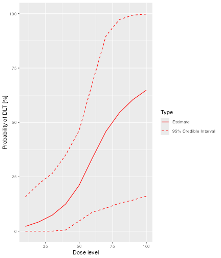
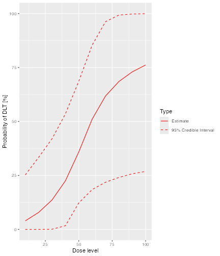
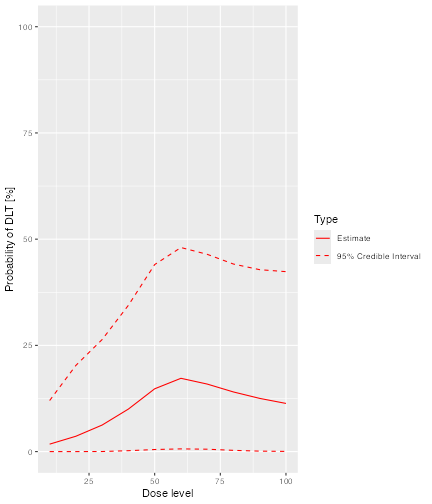

<!-- ordinal-crm.Rmd is generated from ordinal-crm.Rmd.orig Please edit that file -->


``` r
library(crmPack)
```

# Introduction
The original CRM model introduced by [@oquigley1990] dichotomises toxicity events as either "Not toxic" or "DLT".  The ordinal CRM generalises this model by classifying toxicities on an ordinal scale with an arbitrary number of categories (though use of more than three or four would be unusual).

This approach is particularly useful in non-oncology settings, where there is a greater interest in adverse events that are not dose limiting but are nonetheless undesirable.

# Implementation

## Ordinal data
`crmPack` uses the `DataOrdinal` class to record data observed during an ordinal CRM trial.  The `OrdinalData` class differs from the `Data` class only in that it contains an extra slot, `yCategories`, that defines both the number of toxicity grades and their labels.For example:


``` r
empty_ordinal_data <- DataOrdinal(
  doseGrid = c(seq(from = 10, to = 100, by = 10)),
  yCategories = c("No tox" = 0L, "Sub-tox AE" = 1L, "DLT" = 2L),
  placebo = FALSE
)
```

defines a `DataOrdinal` object with three toxicity grades, labelled "No tox`", "Sub-tox AE" and "DLT".

> Note that the `yCategories` slot must be an integer vector with values ordered from `0` to `length(yCategories) - 1`.  Its labels must be unique.  The first entry, which must have value `0`, is always regarded as the "no event" category.  See [The LogisticLogNormalOrdinal class] below.

The `update`, `plot` and `dose_grid_range` methods work exactly as they do for `Data` objects:


``` r
dose_grid_range(empty_ordinal_data)
#> [1]  10 100

ordinal_data <- update(empty_ordinal_data, x = 10, y = 0)
ordinal_data <- update(ordinal_data, x = 20, y = 0)
ordinal_data <- update(ordinal_data, x = 30, y = 0)
ordinal_data <- update(ordinal_data, x = 40, y = 0)
ordinal_data <- update(ordinal_data, x = 50, y = c(0, 1, 0))
ordinal_data <- update(ordinal_data, x = 60, y = c(0, 1, 2))

plot(ordinal_data)
```

<div class="figure">

<p class="caption">plot of chunk data-ordinal-2</p>
</div>

## The `LogisticLogNormalOrdinal` class
`crmPack` fits a constrained logistic log normal model to ordinal data.  The logit of the probability of toxicity at each grade for a given dose is modelled in the log odds space as a linear regression with common slope and a different intercept for each toxicity grade. 

> Note, unlike other model classes, `LogisticLogNormalOrdinal` requires a diagonal covariance matrix.  This is because the constraints on the $alpha;s - the intercept parameters - imposes a correlation on the model's parameters.  Thus, any covariance structure requested by the end user could not be honoured by the model.

Let p~k~(d) be the probability that the response of a patient treated at dose d is in category k *_or higher_*, k=0, ..., K; d=1, ..., D.

Then

$$ \log \left( \frac{p}{1-p}\right) = \alpha_k + \beta \cdot \log \left( \frac{d}{d_{ref}} \right)  $$
for k=1, ..., K [p~0~(d) = 1 by definition] where d~ref~ is a reference dose.  

The &alpha;s are constrained such that &alpha;~1~ > &alpha;~2~ > ... > &alpha;~K~.

The priors for the model's parameters are:

$$ \alpha_k \sim N(\mu_{\alpha_k}, \sigma_{\alpha_k}^2) $$

and

$$ \log(\beta) \sim N(\mu_\beta, \sigma_\beta^2) $$

A `LogisticLogOrdinal` is initialised in exactly the same way as a `LogisticLogNormal` object:


``` r
ordinal_model <- LogisticLogNormalOrdinal(
  mean = c(3, 4, 0),
  cov = diag(c(4, 3, 1)),
  ref_dose = 55
)
```

The entries in the `mean` and `cov` parameters define the hyper priors for &alpha;~1~ to &alpha;~K-1~ and &beta; in that order. 

## Model fitting

`mcmc` works as expected with ordinal models:


``` r
opts <- .DefaultMcmcOptions()

samples <- mcmc(ordinal_data, ordinal_model, opts)
```

> The warning message is expected and can be ignored.  It will be suppressed in a future version of `crmPack`.  See issue 748.

The `Samples` object returned by `mcmc` is a standard `Samples object`.  The names of the entries in its `data` slot are


``` r
names(samples@data)
#> [1] "alpha1" "alpha2" "beta"
```

It can be passed to the `fit` method, using the `grade` parameter to specify the toxicity grade for which cumulative probabilities of toxicity are required:


``` r
fit(samples, ordinal_model, ordinal_data, grade = 1L)
#>    dose     middle        lower     upper
#> 1    10 0.03949875 1.678645e-09 0.2524038
#> 2    20 0.07877838 5.976959e-06 0.3340645
#> 3    30 0.13636343 7.118218e-04 0.4199528
#> 4    40 0.22500425 1.692400e-02 0.5353312
#> 5    50 0.35880628 1.227114e-01 0.6862388
#> 6    60 0.51082063 1.845117e-01 0.8539336
#> 7    70 0.61810151 2.183949e-01 0.9624345
#> 8    80 0.68519241 2.406894e-01 0.9930275
#> 9    90 0.72995711 2.575656e-01 0.9980367
#> 10  100 0.76181500 2.686993e-01 0.9993682
fit(samples, ordinal_model, ordinal_data, grade = 2L)
#>    dose     middle        lower     upper
#> 1    10 0.02194408 8.680902e-10 0.1580412
#> 2    20 0.04261980 2.818773e-06 0.2177480
#> 3    30 0.07384473 2.263737e-04 0.2657173
#> 4    40 0.12485995 5.559757e-03 0.3504994
#> 5    50 0.21098713 4.667764e-02 0.4624503
#> 6    60 0.33830274 8.781944e-02 0.6846460
#> 7    70 0.45914459 1.061435e-01 0.8980023
#> 8    80 0.54481657 1.283684e-01 0.9732507
#> 9    90 0.60472086 1.427195e-01 0.9932776
#> 10  100 0.64843645 1.610623e-01 0.9979508
```

The `cumulative` flag can be used to request grade-specific probabilities.


``` r
fit(samples, ordinal_model, ordinal_data, grade = 1L, cumulative = FALSE)
#>    dose     middle        lower     upper
#> 1    10 0.01755467 6.060484e-10 0.1201824
#> 2    20 0.03615858 2.203459e-06 0.2028914
#> 3    30 0.06251869 2.095851e-04 0.2637984
#> 4    40 0.10014431 2.143267e-03 0.3444481
#> 5    50 0.14781915 4.894673e-03 0.4402163
#> 6    60 0.17251789 6.392095e-03 0.4803180
#> 7    70 0.15895692 5.651918e-03 0.4643434
#> 8    80 0.14037584 2.972841e-03 0.4414463
#> 9    90 0.12523625 1.100144e-03 0.4281609
#> 10  100 0.11337855 4.782504e-04 0.4235453
fit(samples, ordinal_model, ordinal_data, grade = 2L, cumulative = FALSE)
#>    dose     middle        lower     upper
#> 1    10 0.02194408 8.680902e-10 0.1580412
#> 2    20 0.04261980 2.818773e-06 0.2177480
#> 3    30 0.07384473 2.263737e-04 0.2657173
#> 4    40 0.12485995 5.559757e-03 0.3504994
#> 5    50 0.21098713 4.667764e-02 0.4624503
#> 6    60 0.33830274 8.781944e-02 0.6846460
#> 7    70 0.45914459 1.061435e-01 0.8980023
#> 8    80 0.54481657 1.283684e-01 0.9732507
#> 9    90 0.60472086 1.427195e-01 0.9932776
#> 10  100 0.64843645 1.610623e-01 0.9979508
```

> Note that, for `grade == K - 1`, the cumulative and grade-specific probabilities of toxicities are identical.

The `plot` method also takes `grade` and `cumulative` parameters.


``` r
plot(samples, ordinal_model, ordinal_data, grade = 2L)
```

<div class="figure">

<p class="caption">plot of chunk plot1</p>
</div>


``` r
plot(samples, ordinal_model, ordinal_data, grade = 1L)
```

<div class="figure">

<p class="caption">plot of chunk plot2</p>
</div>


``` r
plot(samples, ordinal_model, ordinal_data, grade = 1L, cumulative = FALSE)
```

<div class="figure">

<p class="caption">plot of chunk plot3</p>
</div>

## `Rules` classes for ordinal models
For each class of `Rule` (that is, `CohortSize`, `Increments`, `NextBest` and `Stopping`), `crmPack` provides a single wrapper class that allows the `Rule` to be applied in trials using ordinal CRM models.  The wrapper class has the name `<Rule>Ordinal` and takes two parameters, `rule` and `grade`.  `rule` defines the standard `crmPck` `Rule` and `grade` the toxicity grade at which the rule should be applied. 

For example

``` r
dlt_rule <- CohortSizeDLT(intervals = 0:2, cohort_size = c(1, 3, 5))
ordinal_rule_1 <- CohortSizeOrdinal(grade = 1L, rule = dlt_rule)
ordinal_rule_2 <- CohortSizeOrdinal(grade = 2L, rule = dlt_rule)

size(ordinal_rule_1, 50, empty_ordinal_data)
#> [1] 1
size(ordinal_rule_2, 50, empty_ordinal_data)
#> [1] 1
size(ordinal_rule_1, 50, ordinal_data)
#> [1] 5
size(ordinal_rule_2, 50, ordinal_data)
#> [1] 3
```

`Rules` based on different toxicity grades can be combined to produce complex rules.  Here we define two `Increments` rules, one based on toxicity grade 1, the other on toxicity grade 2.  Recall two sub toxic AEs and one DLT have been reported in the example data set.  

Thus, the rule based on sub-toxic AEs allows a maximum increment of 0.67 because three events have been reported, giving a maximum permitted dose of 100.2.  As only one DLT has been reported, the second rule allows an increment of 0.5, giving a maximum permitted dose of 90. 


``` r
ordinal_rule_1 <- IncrementsOrdinal(
  grade = 1L,
  rule = IncrementsRelativeDLT(intervals = 0:2, increments = c(3, 1.5, 0.67))
)
maxDose(ordinal_rule_1, ordinal_data)
#> [1] 100.2
ordinal_rule_2 <- IncrementsOrdinal(
  grade = 2L,
  rule = IncrementsRelativeDLT(intervals = 0:1, increments = c(3, 0.5))
)
maxDose(ordinal_rule_2, ordinal_data)
#> [1] 90
```

The two grade-specific rules can be combined into a single rule using `IncrementsMin`:


``` r
trial_rule <- IncrementsMin(list(ordinal_rule_1, ordinal_rule_2))
maxDose(trial_rule, ordinal_data)
#> [1] 90
```

# On the need for a diagonal covariance matrix

Consider a standard logistic log Normal CRM model:


``` r
model <- LogisticLogNormal(
  mean = c(-3, 1),
  cov = matrix(c(4, -0.5, -0.5, 3), ncol = 2),
  ref_dose = 45
)

model@params@cov
#>      [,1] [,2]
#> [1,]  4.0 -0.5
#> [2,] -0.5  3.0
```

We can estimate the prior using an empty `Data` object...


``` r
data <- Data(doseGrid = seq(10, 100, 10))
options <- McmcOptions(
  samples = 30000,
  rng_kind = "Mersenne-Twister",
  rng_seed = 8191316
)
samples <- mcmc(data, model, options)
```

and then obtain the correlation between the model's parameters [recalling that the prior is defined in terms of log(alpha1)]...


``` r
d <- as.matrix(cbind(samples@data$alpha0, log(samples@data$alpha1)))
sigmaHat <- cov(d)
sigmaHat
#>            [,1]       [,2]
#> [1,]  4.0094331 -0.5416752
#> [2,] -0.5416752  3.0363958
```

So we requested a covariance of -0.5 and got -0.5416755.2. Pretty good!

Now look an ordinal CRM model with non-zero correlation between its parameters. 

To begin, take a copy of the current `LogisticLogNormalOrdinal` model and give it a non-diagonal covariance matrix by accessing its `params@cov` slot directly, deliberately avoiding object validation.

> NB This is poor practice and not recommended.  It is done here purely for illustration.


``` r
ordinal_model_temp <- ordinal_model
ordinal_model_temp@params@cov <- matrix(c(4, -0.5, -0.5, -0.5, 3, -0.5, -0.5, -0.5, 1), ncol = 3)

ordinal_model_temp@params@cov
#>      [,1] [,2] [,3]
#> [1,]  4.0 -0.5 -0.5
#> [2,] -0.5  3.0 -0.5
#> [3,] -0.5 -0.5  1.0
```

Fit the revised model to obtain the prior.  


``` r
ordinal_data <- DataOrdinal(doseGrid = seq(10, 100, 10))
ordinal_samples <- mcmc(ordinal_data, ordinal_model_temp, options)
```

Finally, look at the covariance matrix, remembering to use `log(beta)` rather than `beta`...


``` r
ordinalD <- as.matrix(
  cbind(
    ordinal_samples@data$alpha1,
    ordinal_samples@data$alpha2,
    log(ordinal_samples@data$beta)
  )
)
sigmaHat <- cov(ordinalD)
sigmaHat
#>             [,1]        [,2]         [,3]
#> [1,]  4.00158899 2.768345336 -0.001112980
#> [2,]  2.76834534 2.924696828  0.008697924
#> [3,] -0.00111298 0.008697924  1.012033823
```

The correlations are nothing like what we requested. This is due to the constraints imposed on the intercepts by the model. The situation will most likely worsen as the number of toxicity categories increases.

We have an open issue - #755 -to examine options for allowing end users to specify correlation structures for ordinal CRM models.  If you would like to contribute, please do so.

# Some observations
- We are currently considering the need for making grade-specific functionality available across more `crmPack` methods.  If you have a specific use case that is not currently supported, please contact us.
- If you have a need for ordinal CRM in dual endpoint models, please let us know.
- Had `crmPack` supported ordinal CRM from the outset, the classes that support standard, binary, CRM models would have been sub-classes of the more general ordinal implementations.  We did consider taking this approach when adding support for ordinal CRM models to the existing code.  We decided against doing so for purely defensive and conservative reasons. Had we introduced the ordinal classes as parents of the existing classes, changes to the code base would have been much more substantial and we were concerned that we might miss some implicit assumptions about the dimensionality of the existing models.  We therefore chose to implement ordinal classes as siblings, rather than parents, of the existing  classes. This approach minimises the risk of breaking existing end-user code at the risk of slightly greater complexity in using the new classes. 

# Environment


```
#> R version 4.6.1 (2026-06-24)
#> Platform: aarch64-apple-darwin23
#> Running under: macOS Tahoe 26.5.1
#> 
#> Matrix products: default
#> BLAS:   /Library/Frameworks/R.framework/Versions/4.6/Resources/lib/libRblas.0.dylib 
#> LAPACK: /Library/Frameworks/R.framework/Versions/4.6/Resources/lib/libRlapack.dylib;  LAPACK version 3.12.1
#> 
#> locale:
#> [1] C.UTF-8/C.UTF-8/C.UTF-8/C/C.UTF-8/C.UTF-8
#> 
#> time zone: Asia/Taipei
#> tzcode source: internal
#> 
#> attached base packages:
#> [1] stats     graphics  grDevices utils     datasets  methods   base     
#> 
#> other attached packages:
#> [1] crmPack_2.2.0  testthat_3.3.2 ggplot2_4.0.3 
#> 
#> loaded via a namespace (and not attached):
#>  [1] tidyselect_1.2.1     viridisLite_0.4.3    dplyr_1.2.1         
#>  [4] farver_2.1.2         R.utils_2.13.0       rjags_4-17          
#>  [7] S7_0.2.2             fastmap_1.2.0        webshot2_0.1.2      
#> [10] promises_1.5.0       digest_0.6.39        lifecycle_1.0.5     
#> [13] ellipsis_0.3.3       survival_3.8-6       processx_3.9.0      
#> [16] magrittr_2.0.5       compiler_4.6.1       rlang_1.2.0         
#> [19] tools_4.6.1          knitr_1.51           lambda.r_1.2.4      
#> [22] labeling_0.4.3       pkgbuild_1.4.8       xml2_1.6.0          
#> [25] RColorBrewer_1.1-3   pkgload_1.5.3        websocket_1.4.4     
#> [28] R.cache_0.17.0       withr_3.0.3          purrr_1.2.2         
#> [31] R.oo_1.27.1          desc_1.4.3           grid_4.6.1          
#> [34] scales_1.4.0         cli_3.6.6            mvtnorm_1.4-1       
#> [37] rmarkdown_2.31       ragg_1.5.2           generics_0.1.4      
#> [40] otel_0.2.0           rstudioapi_0.19.0    sessioninfo_1.2.4   
#> [43] cachem_1.1.0         chromote_0.5.1       stringr_1.6.0       
#> [46] splines_4.6.1        parallel_4.6.1       formatR_1.14        
#> [49] vctrs_0.7.3          devtools_2.5.2       Matrix_1.7-5        
#> [52] jsonlite_2.0.0       GenSA_1.1.15         systemfonts_1.3.2   
#> [55] glue_1.8.1           parallelly_1.47.0    codetools_0.2-20    
#> [58] stringi_1.8.7        gtable_0.3.6         futile.logger_1.4.9 
#> [61] later_1.4.8          tibble_3.3.1         styler_1.11.0       
#> [64] pillar_1.11.1        htmltools_0.5.9      brio_1.1.5          
#> [67] R6_2.6.1             textshaping_1.0.5    Rdpack_2.6.6        
#> [70] rprojroot_2.1.1      evaluate_1.0.5       kableExtra_1.4.0    
#> [73] lattice_0.22-9       R.methodsS3_1.8.2    futile.options_1.0.1
#> [76] rbibutils_2.4.1      backports_1.5.1      memoise_2.0.1       
#> [79] Rcpp_1.1.1-1.1       svglite_2.2.2        coda_0.19-4.1       
#> [82] gridExtra_2.3.1      checkmate_2.3.4      xfun_0.59           
#> [85] fs_2.1.0             usethis_3.2.1        pkgconfig_2.0.3
```
# References
