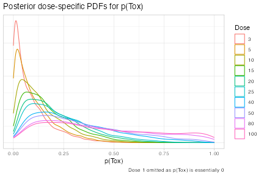

<!-- tidy_method.Rmd is generated from tidy_method.Rmd.orig Please edit that file -->


``` r
suppressPackageStartupMessages({
  library(crmPack)
  library(knitr)
  library(kableExtra)
  library(tidyr)
  library(magrittr)
  library(dplyr)
})
```

# Introducing tidy methods to crmPack
The latest release of `crmPack` introduces `broom`-like tidy methods for all `crmPack` classes.  These methods convert the underlying S4 classes to (lists of) `tibble`s.  This should facilitate reporting of all aspects of CRM trials as well as making it easier to integrate `crmPack` with other packages such as `ggplot2`.

## Basic approach
The following is the general approach we take to tidying `crmPack` classes:

* All slots that are not functions are converted to `tibble`s or a list of `tibble`s.
* If the slot's value is a `list`, these rules are applied to each element of the list in turn.
* If the slot's value is scalar, the slot is converted to a 1x1 `tibble`.  This will ease downstream operations such as `row_bind`ing.
* If the object being tidied contains multiple slots of (potentially) different lengths, the result is a list of `tibble`s.  The list may be nested to multiple levels.  (See, for example, `LogisticLogNormal`.)
* The column names of the tidied `tibble` correspond to the slot names of the parent object.
  * Exception: where the slot has name in the plural and contains a `vector` or `list`, the column name will be singular.  See, for example, `CohortSizeParts` below.
* When the value of a slot has not been set, a zero-row `tibble` is returned.
* When the value of a slot has scalar attributes, these attributes are added as columns of the `tibble`, whose name is the name of the attribute and whose value is the value of the attribute for every row of the tibble.  Vector attributes can be added, by default, as a nested tibble.
  The nested tibble is 1 row x n column, with column names defined by the name of the attribute and values given by the value of the corresponding attribute.
* `tbl_<className>` is prepended to the class of the (list of) tidy `tibble`(s).

## Exceptions
*  Where a vector slot (or series of vector slots) define a range ()for example, the `intervals` slot in various `CohortSize` and `Increments` classes, then the naming convention described above is not followed.  Instead, columns named `min` and `max` define the extent of the range.

## Examples

`CohortSizeConst` is a trivial example and illustrates the default approach for all classes.


``` r
CohortSizeConst(size = 3) %>% tidy()
#> # A tibble: 1 × 1
#>    size
#>   <int>
#> 1     3
```

`IncrementsRelative` illustrate how ranges are handled.


``` r
IncrementsRelative(
  intervals = c(0, 20),
  increments = c(1, 0.33)
) %>%
  tidy()
#> # A tibble: 2 × 3
#>     min   max increment
#>   <dbl> <dbl>     <dbl>
#> 1     0    20      1   
#> 2    20   Inf      0.33
```

`CohortSizeMax` contains a slot whose value is a list.


``` r
cs_max <- maxSize(
  CohortSizeConst(3),
  CohortSizeDLT(intervals = 0:1, cohort_size = c(1, 3))
)
cs_max %>% tidy()
#> [[1]]
#> # A tibble: 1 × 1
#>    size
#>   <int>
#> 1     3
#> 
#> [[2]]
#> # A tibble: 2 × 3
#>     min   max cohort_size
#>   <dbl> <dbl>       <int>
#> 1     0     1           1
#> 2     1   Inf           3
#> 
#> attr(,"class")
#> [1] "tbl_CohortSizeMax" "tbl_CohortSizeMax" "list"
```

The `Samples` class likely to the most useful when making presentations not yet supported by `crmPack` directly.


``` r
options <- McmcOptions(
  burnin = 100,
  step = 1,
  samples = 2000
)

emptydata <- Data(doseGrid = c(1, 3, 5, 10, 15, 20, 25, 40, 50, 80, 100))

model <- LogisticLogNormal(
  mean = c(-0.85, 1),
  cov =
    matrix(c(1, -0.5, -0.5, 1),
      nrow = 2
    ),
  ref_dose = 56
)
samples <- mcmc(emptydata, model, options)
tidySamples <- samples %>% tidy()
tidySamples %>% head()
#> $data
#> # A tibble: 2,000 × 10
#>    Iteration Chain alpha0 alpha1 nChains nParameters nIterations nBurnin nThin
#>        <int> <int>  <dbl>  <dbl>   <int>       <int>       <int>   <int> <int>
#>  1         1     1  1.27   0.220       1           1        2100     100     1
#>  2         2     1 -1.55   8.04        1           1        2100     100     1
#>  3         3     1 -2.09   2.12        1           1        2100     100     1
#>  4         4     1  1.34   0.488       1           1        2100     100     1
#>  5         5     1 -0.803  1.05        1           1        2100     100     1
#>  6         6     1 -1.25   4.93        1           1        2100     100     1
#>  7         7     1 -1.88   1.47        1           1        2100     100     1
#>  8         8     1 -2.94   5.96        1           1        2100     100     1
#>  9         9     1  0.835  3.26        1           1        2100     100     1
#> 10        10     1  0.941  2.48        1           1        2100     100     1
#> # ℹ 1,990 more rows
#> # ℹ 1 more variable: parallel <lgl>
#> 
#> $options
#> # A tibble: 1 × 5
#>   iterations burnin  step rng_kind rng_seed
#>        <int>  <int> <int> <chr>       <int>
#> 1       2100    100     1 <NA>           NA
```

## Using tidy `crmPack` data

Tidy `crmPack` data can be easily reported using `knitr` or similar packages in the obvious way.

### Cohort size

The cohort size for this trial is determined by the dose to be used in the current cohort according to the rules described in the table below:


``` r
CohortSizeRange(
  intervals = c(0, 50, 300),
  cohort_size = c(1, 3, 5)
) %>%
  tidy() %>%
  kable(
    col.names = c("Min", "Max", "Cohort size"),
    caption = "Rules for selecting the cohort size"
  ) %>%
  add_header_above(c("Dose" = 2, " " = 1))
```

<table>
<caption>Rules for selecting the cohort size</caption>
 <thead>
<tr>
<th style="border-bottom:hidden;padding-bottom:0; padding-left:3px;padding-right:3px;text-align: center; " colspan="2"><div style="border-bottom: 1px solid #ddd; padding-bottom: 5px; ">Dose</div></th>
<th style="empty-cells: hide;border-bottom:hidden;" colspan="1"></th>
</tr>
  <tr>
   <th style="text-align:right;"> Min </th>
   <th style="text-align:right;"> Max </th>
   <th style="text-align:right;"> Cohort size </th>
  </tr>
 </thead>
<tbody>
  <tr>
   <td style="text-align:right;"> 0 </td>
   <td style="text-align:right;"> 50 </td>
   <td style="text-align:right;"> 1 </td>
  </tr>
  <tr>
   <td style="text-align:right;"> 50 </td>
   <td style="text-align:right;"> 300 </td>
   <td style="text-align:right;"> 3 </td>
  </tr>
  <tr>
   <td style="text-align:right;"> 300 </td>
   <td style="text-align:right;"> Inf </td>
   <td style="text-align:right;"> 5 </td>
  </tr>
</tbody>
</table>


Or presentations not directly supported by `crmPack` can be easily produced.  Here, we create plots of the dose-specific PDFs for prior probabilities of toxicity after the first DLT is observed in a fictional trial.


``` r
options <- McmcOptions(
  burnin = 5000,
  step = 1,
  samples = 40000
)

data <- Data(
  doseGrid = c(1, 3, 5, 10, 15, 20, 25, 40, 50, 80, 100),
  x = c(1, 3, 5, 10, 15, 15, 15),
  y = c(0, 0, 0, 0, 0, 1, 0),
  ID = 1L:7L,
  cohort = as.integer(c(1:4, 5, 5, 5))
)

model <- LogisticLogNormal(
  mean = c(-1, 0),
  cov =
    matrix(c(3, -0.1, -0.1, 4),
      nrow = 2
    ),
  ref_dose = 56
)
samples <- mcmc(data, model, options)
tidySamples <- samples %>% tidy()

# The magrittr pipe is necessary here
tidySamples$data %>%
  expand(
    nesting(!!!.[1:10]),
    Dose = data@doseGrid[2:11]
  ) %>%
  mutate(Prob = probFunction(model, alpha0 = alpha0, alpha1 = alpha1)(Dose)) %>%
  ggplot() +
  geom_density(aes(x = Prob, colour = as.factor(Dose)), adjust = 1.5) +
  labs(
    title = "Posterior dose-specific PDFs for p(Tox)",
    caption = "Dose 1 omitted as p(Tox) is essentially 0",
    x = "p(Tox)"
  ) +
  scale_colour_discrete("Dose") +
  theme_light() +
  theme(
    axis.ticks.y = element_blank(),
    axis.text.y = element_blank(),
    axis.title.y = element_blank()
  )
```

<div class="figure">

<p class="caption">plot of chunk unnamed-chunk-7</p>
</div>

# Environment


``` r
sessionInfo()
#> R version 4.6.1 (2026-06-24)
#> Platform: aarch64-apple-darwin23
#> Running under: macOS Tahoe 26.5.1
#> 
#> Matrix products: default
#> BLAS:   /Library/Frameworks/R.framework/Versions/4.6/Resources/lib/libRblas.0.dylib 
#> LAPACK: /Library/Frameworks/R.framework/Versions/4.6/Resources/lib/libRlapack.dylib;  LAPACK version 3.12.1
#> 
#> locale:
#> [1] C.UTF-8/C.UTF-8/C.UTF-8/C/C.UTF-8/C.UTF-8
#> 
#> time zone: Asia/Taipei
#> tzcode source: internal
#> 
#> attached base packages:
#> [1] stats     graphics  grDevices utils     datasets  methods   base     
#> 
#> other attached packages:
#> [1] dplyr_1.2.1      magrittr_2.0.5   tidyr_1.3.2      kableExtra_1.4.0
#> [5] knitr_1.51       crmPack_2.2.0    testthat_3.3.2   ggplot2_4.0.3   
#> 
#> loaded via a namespace (and not attached):
#>  [1] tidyselect_1.2.1     viridisLite_0.4.3    farver_2.1.2        
#>  [4] R.utils_2.13.0       rjags_4-17           S7_0.2.2            
#>  [7] fastmap_1.2.0        webshot2_0.1.2       promises_1.5.0      
#> [10] digest_0.6.39        lifecycle_1.0.5      ellipsis_0.3.3      
#> [13] survival_3.8-6       processx_3.9.0       compiler_4.6.1      
#> [16] rlang_1.2.0          tools_4.6.1          utf8_1.2.6          
#> [19] lambda.r_1.2.4       labeling_0.4.3       pkgbuild_1.4.8      
#> [22] xml2_1.6.0           RColorBrewer_1.1-3   pkgload_1.5.3       
#> [25] websocket_1.4.4      R.cache_0.17.0       withr_3.0.3         
#> [28] purrr_1.2.2          R.oo_1.27.1          desc_1.4.3          
#> [31] grid_4.6.1           scales_1.4.0         cli_3.6.6           
#> [34] mvtnorm_1.4-1        rmarkdown_2.31       ragg_1.5.2          
#> [37] generics_0.1.4       otel_0.2.0           rstudioapi_0.19.0   
#> [40] sessioninfo_1.2.4    cachem_1.1.0         chromote_0.5.1      
#> [43] stringr_1.6.0        splines_4.6.1        parallel_4.6.1      
#> [46] formatR_1.14         vctrs_0.7.3          devtools_2.5.2      
#> [49] Matrix_1.7-5         jsonlite_2.0.0       GenSA_1.1.15        
#> [52] systemfonts_1.3.2    glue_1.8.1           parallelly_1.47.0   
#> [55] codetools_0.2-20     stringi_1.8.7        gtable_0.3.6        
#> [58] futile.logger_1.4.9  later_1.4.8          tibble_3.3.1        
#> [61] styler_1.11.0        pillar_1.11.1        htmltools_0.5.9     
#> [64] brio_1.1.5           R6_2.6.1             textshaping_1.0.5   
#> [67] Rdpack_2.6.6         rprojroot_2.1.1      evaluate_1.0.5      
#> [70] lattice_0.22-9       R.methodsS3_1.8.2    futile.options_1.0.1
#> [73] rbibutils_2.4.1      backports_1.5.1      memoise_2.0.1       
#> [76] Rcpp_1.1.1-1.1       svglite_2.2.2        coda_0.19-4.1       
#> [79] gridExtra_2.3.1      checkmate_2.3.4      xfun_0.59           
#> [82] fs_2.1.0             usethis_3.2.1        pkgconfig_2.0.3
```
